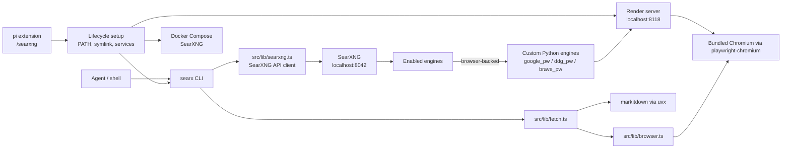
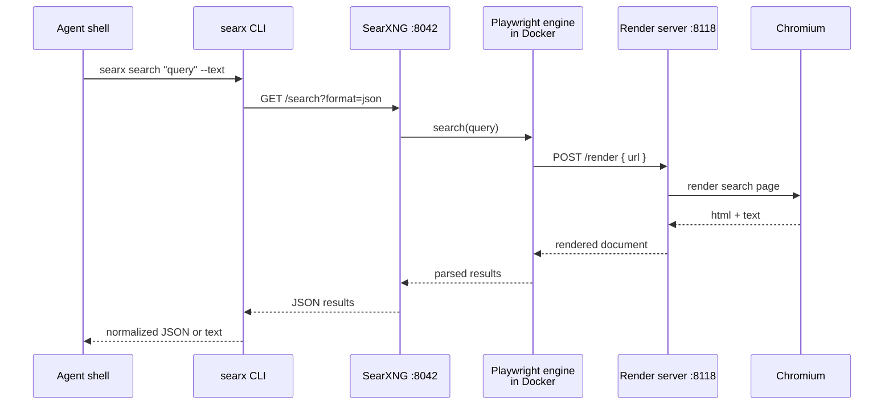

# pi-searxng Architecture

`pi-searxng` is a CLI-first pi package for local web search. The pi extension owns lifecycle and status; agents search and fetch through the `searx` CLI.

## Components

- `bin/searx` — executable wrapper loaded by pi and shell PATH.
- `src/cli.ts` — Commander CLI entrypoint.
- `src/index.ts` — thin pi extension: `/searxng`, PATH/symlink setup, session-start lifecycle.
- `src/lib/searxng.ts` — SearXNG JSON API client and engine listing.
- `src/lib/service.ts` — Docker Compose lifecycle for the bundled SearXNG service.
- `src/lib/browser.ts` — Playwright rendering/auth using bundled `playwright-chromium`, with optional system browser override.
- `src/lib/render.ts` — background render-server lifecycle and PID/log files.
- `src/render-server.ts` — HTTP service used by custom SearXNG engines.
- `docker/` — Docker Compose, SearXNG settings, and custom offline engines.
- `skills/search/` — agent-facing operational guidance.

## Data flow: search

1. Agent runs `searx search ...` from bash.
2. CLI calls local SearXNG at `http://localhost:8042/search?format=json`.
3. SearXNG queries enabled engines.
4. Browser-backed engines call `http://host.docker.internal:8118/render`.
5. Render server launches/reuses Chromium through Playwright and returns HTML/text.
6. Custom Python engine parses results and returns them to SearXNG.
7. CLI normalizes output to JSON or `--text`.

## Data flow: fetch/browse

- `searx fetch URL` uses markitdown first and browser rendering when forced or needed.
- `searx browse URL` directly renders through Playwright and extracts text/selectors.

## Design rules

- CLI is the primary interface; keep pi tools thin.
- Extension commands manage lifecycle/status, not search results.
- Use generic browser configuration (`SEARX_BROWSER_PATH`, persistent config), not platform monkey patches.
- Use human-auth browser profiles; no CAPTCHA solver or stealth-bypass dependency.
